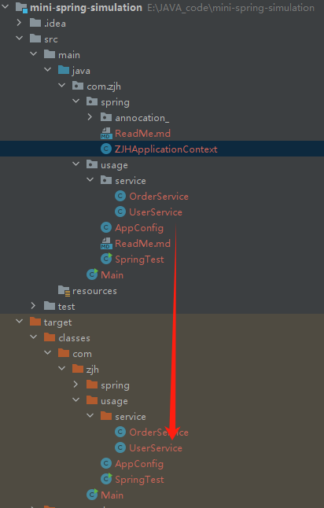

# Spring 包  
    用于存放spring相关的基础类
    Spring
        |-annocatin_ 注解类
            |-@ComponentScan：用于路径扫描
            |-@Component：用于声明Bean对象
        |-ZJHApplicationContext
    ZJHApplicationContext 模拟IOC容器，管理bean对象
## ZJHApplicationContext类
    该类是就是Spring框架用于管理Bean对象的IOC容器
    在启动过程中（初始化阶段）就需要完成诸如
    1. Bean目录path获取
    2. 根据path扫描Bean对象
**根据path扫描Bean对象扫描的是哪个文件？**

    应当扫描的是target目录下编译生成的.class文件

    why?
    JVM底层有三个classloader
    
    BootStrap classloader 负责加载 /jre/lib 下面的class文件
    Extension classloader 负责加载 /jre/ext/lib 下面的class文件
    Application classloader 负责加载 其他的目录，包括自己编写的代码存放的class文件的数据
    而自己编写生成的class文件就是被维护在了/target/classes/···中了
**所以可以根据classloader来获取当前类的绝对路径！**

    
